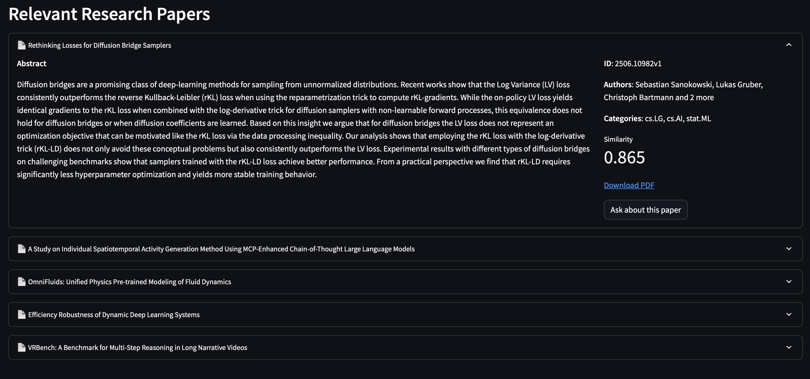

# PaperAI


Research paper analysis and discovery system using LangChain, Weaviate, and custom LLM models. This is a project with a focus on infrastructure design, monitoring, and microservices.



## Quick Start

### 1. Environment Setup

```bash
# Clone and setup
git clone git@github.com:xmarva/voice-arxiv.git
cd voice-arxiv

# Copy environment variables
cp .env.example .env
# Edit .env with your configuration

# Run setup script
chmod +x scripts/setup.sh
./scripts/setup.sh
```

### 2. Start Microservices

```bash
# Option 1: Docker Compose (all services)
cd infrastructure/docker
docker-compose up -d

# Option 2: Local Development (selective)
python -m src.api.main  # API service
python -m src.rag.main  # RAG service
```

### 3. Access Services Locally

- **PaperAI Application**: http://localhost:8000
- **Grafana (Monitoring)**: http://localhost:3000 (admin/admin)
- **Prometheus (Metrics)**: http://localhost:9090
- **Weaviate (Vector DB)**: http://localhost:8080

## Configuration

### Environment Variables

```bash
# Core Services
WEAVIATE_URL=http://localhost:8080
LLM_API_KEY=your_token  # For API-based LLM

# Models
LLM_MODEL_NAME=local-rule-based  # Fallback model
EMBEDDING_MODEL_NAME=sentence-transformers/all-MiniLM-L6-v2

# Monitoring
PROMETHEUS_PORT=9090
GRAFANA_PORT=3000
```

## Project Structure

```
paperai/
├── src/                 # Core application code
│   ├── api/            # FastAPI routes (main app)
│   ├── database/       # Weaviate client
│   ├── rag/            # RAG pipeline (microservice)
│   ├── models/         # LLM and embedding models
│   ├── monitoring/     # Metrics and profiling
│   └── utils/          # Utilities
├── infrastructure/     # Docker, monitoring configs
│   ├── docker/         # Docker setups
│   └── monitoring/     # Grafana, Prometheus
├── frontend/           # Static web UI
├── tests/              # Test suite
└── scripts/            # Setup and deployment
```

## Microservices

1. **API Service**: Handles HTTP requests and responses (`src/api`)
2. **RAG Service**: Manages retrieval-augmented generation pipeline (`src/rag`)
3. **Monitoring**: Grafana, Prometheus (`infrastructure/monitoring`)

## Development

### Running Tests

```bash
pytest tests/ -v
```

### Debugging

```bash
# Tail logs
docker-compose logs -f
```

## Monitoring

Pre-configured Grafana dashboards track:
- API performance
- RAG pipeline latency
- System health

## Deployment

### Docker Production

```bash
cd infrastructure/docker
docker-compose -f docker-compose.prod.yml up -d
```

### Kubernetes

```bash
kubectl apply -f infrastructure/deployment/k8s/
```